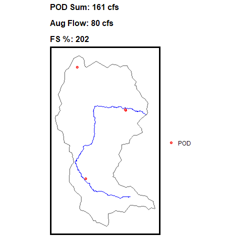
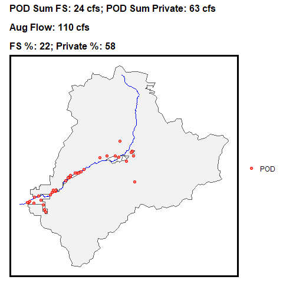

<!-- README.md is generated from README.Rmd. Please edit that file -->

# wrqur

Water Rights Quantification/Uses for R provides methods for retrieving
water allocation and flow data. It uses functions that call API’s or use
local data to compare [Points of Diversion
(POD)](https://ftpgeoinfo.msl.mt.gov/Data/Spatial/NonMSDI/DNRC_WR/MTWaterRights.gdb.zip)
in Montana with
[FlowMet](https://www.fs.usda.gov/rm/boise/AWAE/projects/modeled_stream_flow_metrics.shtml)
flow outputs for the month of August. This work was developed by Brianna
Niehoff for her master’s thesis at the University of Montana.

In addition, the package uses a
[{targets}](https://books.ropensci.org/targets/) pipeline to help with
updating POD or FlowMet derivatives.

## Installation

You can install the development version of wrqur from
[GitHub](https://github.com/) with:

``` r
# install.packages("devtools")
devtools::install_github("soilwaterfish/wrqur")
```

## Methods

The model takes in any basin configuration and then calls local files or
APIs with FlowMet `get_flowmet()`, Forest Service Administration
Boundaries `get_adminboundaries()`, and PODs `get_mtwr()`. From there,
utility functions help generate the intersecting FlowMet, Administration
Boundaries, and POD values via common identifiers (COMID) and basins
(see GIF below). This then relates all flow allocation metrics to \> 1st
order (Strahler) streamlines via COMID and provides the following
attributes:
`intersecting_sites, intersecting_flow_all_together, intersecting_flow_fs, intersecting_flow_private, MAUG_HIST, gnis_name, intersecting_flow_all_together_percent, intersecting_flow_fs_percent, intersecting_flow_private_percent`.

<div style="display: flex;">

<div class="{"50%"}">

**Forest Service Only** 

</div>

<div class="{'50%'}">

**Mix of Private and Forest Service**


</div>

</div>

## Example

The example below shows how the to call the `targets` package.

``` r
library(targets)

#This will run the targets workflow

tar_make() 

# or for parallel processing

tar_make_future(workers = 10)
```

If needed, you can change the `_targets.R` file to adjust for local/API
calls or starting basins.

``` r

# Load packages required to define the pipeline:
library(targets)
library(tarchetypes)
library(future)
library(future.callr)
plan(callr)

# Set target options:
tar_option_set(packages = c( "wrqur", "nhdplusTools", "furrr","tidyverse",  "sf")
)

### This `basin_entry` will depend on the user defined watershed boundary.
values = dplyr::tibble(values = c("data/kootenai.shp",
                                  "data/clark_fork.shp",
                                  "data/missouri.shp",
                                  "data/yellowstone.shp"
                                  "data/little_missouri.shp"
                                  ))
targets <- tar_map(

values = values,

tar_target(basin, sf::read_sf(values)),

tar_target(basin_crs, sf::st_crs(basin)),

tar_target(admin_int, suppressMessages(get_adminboundaries(filter_geom = sf::st_bbox(sf::st_transform(basin, 4269)),
                                                           where = "OWNERCLASSIFICATION='USDA FOREST SERVICE' OR OWNERCLASSIFICATION='UNPARTITIONED RIPARIAN INTEREST'")%>%
                                         sf::st_transform(crs = basin_crs) %>%
                                         sf::st_make_valid() %>%
                                         sf::st_intersection(basin) %>%
                                         sf::st_union() %>%
                                         sf::st_as_sf())),

tar_target(flowmet_intersect, get_flowmet(filter_geom = basin, local_path = r"{Z:\Downloads\S_USA.Hydro_FlowMet_1990s.gdb\S_USA.Hydro_FlowMet_1990s.gdb}")  %>%
             sf::read_sf()%>%
             sf::st_zm() %>%
             dplyr::select(c("MAUG_HIST", "COMID")) %>%
                                      sf::st_transform(crs = basin_crs) %>%
                                      sf::st_intersection(basin)),

tar_target(nhdplus, nhdplusTools::get_nhdplus(sf::st_as_sfc(sf::st_bbox(flowmet_intersect)))),

tar_target(flowmet_join_nhdplus, flowmet_intersect %>% dplyr::select(MAUG_HIST, COMID) %>%
    dplyr::left_join(nhdplus %>%
                       sf::st_drop_geometry() %>%
                       dplyr::mutate(comid = as.character(comid)), by = c('COMID' = 'comid'))
),

tar_target(pou, get_mtwr(basin, layer = 'WR1POU', local_path =  r'{Z:\Downloads\MTWaterRights.gdb\MTWaterRights.gdb}') %>%
             sf::read_sf() %>%
             dplyr::group_by(WRKEY) %>%
             dplyr::slice(1) %>%
             dplyr::ungroup()),

tar_target(pod, get_mtwr(basin, layer = 'WR1DIV', local_path =  r'{Z:\Downloads\MTWaterRights.gdb\MTWaterRights.gdb}') %>%
             sf::read_sf() %>%
             dplyr::group_by(WRKEY) %>%
             dplyr::slice(1) %>%
             dplyr::ungroup() %>%
             dplyr::filter(WRKEY %in% pou$WRKEY)),

tar_target(pou_pod_together, suppressMessages(pod %>%
                                                  dplyr::left_join(pou %>%
                                                                     sf::st_drop_geometry() %>%
                                                                     dplyr::select(c("WRKEY", "PURPOSE", "IRRTYPE", "MAXACRES", "FLWRTGPM", "FLWRTCFS", "VOL", "ACREAGE"))))
),

tar_target(pou_pod_together_sf, date_cleaning(pou_pod_together)),

tar_target(flowmet_grt_strahler_1_order, flowmet_join_nhdplus %>% filter(streamorde > 1)),

tar_target(crs, sf::st_crs(pou_pod_together_sf)),

tar_target(basins, get_pod_basins(flowmet_grt_strahler_1_order, crs)),

tar_target(pou_pod_together_fs_intersection, fs_logic(pou_pod_together_sf, admin_int)),

tar_target(adding_intersecting_flows, basins %>% split(.$COMID) %>%
             furrr::future_map(
               ~capture_sites_within(.x, pou_pod_together_fs_intersection)) %>%
             dplyr::bind_rows() %>%
             sf::st_as_sf()),
tar_target(pou_pod_together_sf_final_joined, adding_intersecting_flows %>%
             st_drop_geometry() %>%
             left_join(flowmet_grt_strahler_1_order %>% select(COMID,MAUG_HIST, gnis_name, qe_08)) %>%
             st_as_sf() %>%
             mutate(
               intersecting_flow_all_together_percent = (intersecting_flow_all_together/MAUG_HIST)*100,
               intersecting_flow_fs_percent = (intersecting_flow_fs/MAUG_HIST)*100,
               intersecting_flow_private_percent = (intersecting_flow_private/MAUG_HIST)*100
             ))
)


list(targets)
```
